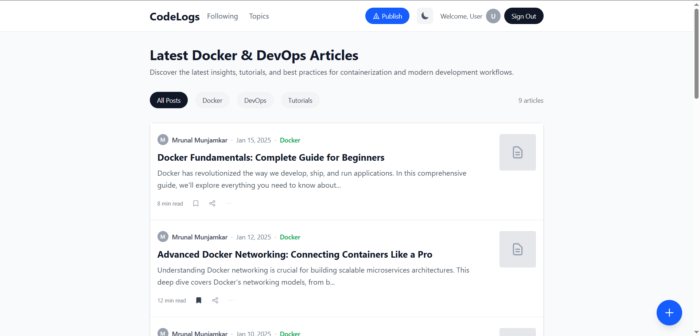
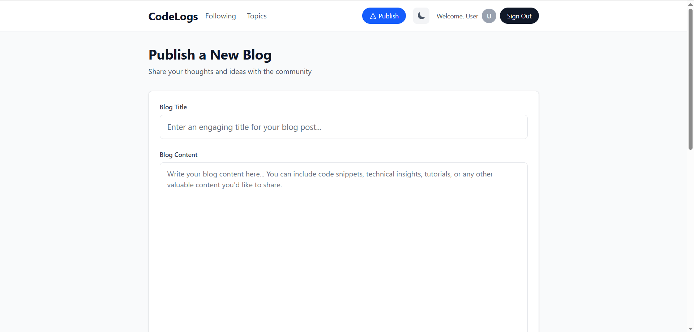
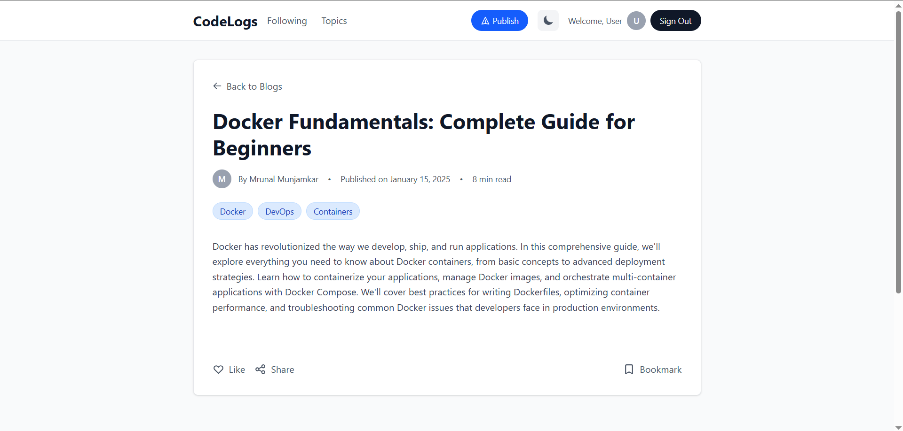

# CodeLogs Blog

A comprehensive full-stack blog application built with modern web technologies, featuring a React frontend with advanced theming, Cloudflare Workers backend, and PostgreSQL database with intelligent content management.

## 🎯 Quick Preview

| Feature | Screenshot |
|---------|------------|
| **🏠 Homepage** |  |
| **📝 Publishing** |  |
| **🔐 Authentication** |  |
| **📚 Blog Discovery** |  |

## 🚀 Features

### 🎨 **User Experience**
- **Advanced Theme System** - Dark/light mode with system preference detection and smooth transitions
- **Responsive Design** - Mobile-first design with Tailwind CSS v4 and optimized layouts
- **Real-time Feedback** - Loading states, error handling, success notifications, and visual feedback
- **Interactive UI** - Hover effects, smooth animations, and intuitive navigation

### 🔐 **Authentication & Security**
- **JWT Authentication** - Secure user sessions with token-based authentication
- **Protected Routes** - Route guards for authenticated-only content
- **User Management** - Sign up, sign in, and profile management

### 📝 **Content Management**
- **Rich Blog Publishing** - Intuitive blog creation form with real-time validation
- **Draft Management** - Auto-save drafts to localStorage with manual save/clear options
- **Blog CRUD Operations** - Create, read, update, and delete blog posts
- **Content Search** - API integration for blog discovery and listing

### 🏷️ **Smart Content Features**
- **Intelligent Tag Extraction** - Automatic tag generation from blog content with proper capitalization
- **Read Time Estimation** - Dynamic reading time calculation based on content length
- **Author Attribution** - Complete author information display
- **Content Metadata** - Publication dates, update tracking, and content statistics

### 🎯 **Technical Excellence**
- **API Integration** - Seamless backend integration with comprehensive error handling
- **Type Safety** - Full TypeScript support across the entire stack
- **Serverless Architecture** - Deployed on Cloudflare Workers for global edge performance
- **Database Management** - Prisma ORM with PostgreSQL and migration support
- **Mock Data Fallbacks** - Graceful degradation with mock content for development

## 📸 Screenshots

### 🏠 **Home Page**

*Clean, responsive homepage with theme toggle and modern design*

### 📝 **Blog Publishing**

*Advanced blog creation form with draft management and real-time validation*

### 🔐 **Authentication**

*Secure user authentication with modern UI design*

### 📚 **Blog Discovery**

*Blog listing page with smart tags, metadata, and responsive cards*

---

### 🎨 **Key Visual Features Demonstrated**

🔹 **Modern UI Design** - Clean, professional interface with consistent styling  
🔹 **Dark/Light Theme** - Seamless theme switching with system preference detection  
🔹 **Responsive Layout** - Mobile-first design that works on all screen sizes  
🔹 **Smart Typography** - Readable fonts and proper spacing throughout  
🔹 **Interactive Elements** - Hover effects, buttons, and navigation components  
🔹 **Content Organization** - Well-structured blog cards with metadata display  
🔹 **Form Design** - Intuitive forms with validation and user feedback  
🔹 **Navigation** - Clear header navigation with user authentication status  

## 🏗️ Architecture

This is a monorepo containing three main packages:

### Frontend (`/frontend`)
- **React 19** with TypeScript for modern component architecture
- **Vite 7** for lightning-fast development and optimized builds
- **Tailwind CSS v4** with @tailwindcss/vite plugin for advanced styling
- **React Router v7** for sophisticated client-side routing
- **Context API** for global state management (theme, authentication)
- **Custom Hooks** for reusable logic (useAuth, useTheme)
- **Component Library** - Comprehensive UI components with dark mode support
- **Advanced Features**:
  - Smart tag extraction and capitalization
  - Draft management with localStorage persistence
  - Real-time content validation
  - Loading skeletons and error boundaries
  - Responsive design patterns

### Backend (`/backend`)
- **Hono** - Fast, lightweight web framework for Cloudflare Workers
- **Prisma 6** - Type-safe database ORM with Accelerate for global performance
- **PostgreSQL** - Production-ready database with full ACID compliance
- **JWT Authentication** - Secure user sessions with token-based auth
- **Cloudflare Workers** - Serverless deployment with edge computing
- **RESTful API** - Comprehensive endpoints for blog and user management
- **Database Migrations** - Version-controlled schema management
- **Type Safety** - End-to-end TypeScript integration

### Common (`/common`)
- **Zod** - Runtime type validation
- **Shared Types** - TypeScript interfaces for API contracts
- **NPM Package** - Published as `@mrunal121/codelogs-blog-common`

## 📦 Tech Stack

### Frontend Technologies
- **React 19.1.1** - Latest React with concurrent features
- **TypeScript** - Type safety and enhanced developer experience
- **Vite 7.1.2** - Next-generation frontend tooling
- **Tailwind CSS 4.1.12** - Utility-first CSS framework with v4 features
- **React Router DOM 7.8.0** - Advanced routing with nested routes
- **Context API** - Built-in state management solution

### Backend Technologies
- **Hono 4.7.10** - Modern web framework for edge computing
- **Prisma 6.8.2** - Next-generation ORM with type safety
- **Cloudflare Workers** - Serverless compute platform
- **PostgreSQL** - Advanced relational database via Prisma Accelerate
- **JWT** - Industry-standard authentication tokens

### Development & Build Tools
- **ESLint** - Code linting and quality enforcement
- **PostCSS** - CSS processing and optimization
- **Wrangler** - Cloudflare Workers CLI and development tools
- **TypeScript** - Static type checking across the stack
- **Vite** - Fast build tool with HMR and optimizations

## 🚀 Getting Started

### Prerequisites
- Node.js (v18 or higher)
- npm or yarn
- Cloudflare account (for deployment)

### Installation

1. **Clone the repository**
   ```bash
   git clone https://github.com/Mrunal112/devlogs-blog.git
   cd codelogs-blogs
   ```

2. **Install dependencies for all packages**
   ```bash
   # Install frontend dependencies
   cd frontend
   npm install

   # Install backend dependencies
   cd ../backend
   npm install

   # Install common package dependencies
   cd ../common
   npm install
   ```

### Development Setup

1. **Set up the database**
   ```bash
   cd backend
   # Configure your DATABASE_URL in wrangler.jsonc
   npx prisma migrate dev
   ```

2. **Start the backend development server**
   ```bash
   cd backend
   npm run dev
   # Backend runs on Cloudflare Workers local development environment
   ```

3. **Start the frontend development server**
   ```bash
   cd frontend
   npm run dev
   # Frontend will be available at http://localhost:5173
   ```

4. **Build the common package** (if making changes)
   ```bash
   cd common
   npm run build
   ```

### 🎯 **Available Features After Setup**
- ✅ **Theme Toggle** - Dark/light mode with system preference
- ✅ **User Authentication** - Sign up, sign in, and protected routes
- ✅ **Blog Publishing** - Create blogs with draft auto-save
- ✅ **Blog Discovery** - Browse all blogs with API integration
- ✅ **Individual Blog Pages** - Read full articles with metadata
- ✅ **Smart Tags** - Auto-generated tags with proper capitalization
- ✅ **Responsive Design** - Works seamlessly on all devices

## 📁 Project Structure

```
codelogs-blogs/
├── frontend/                 # React frontend application
│   ├── src/
│   │   ├── components/      # Reusable UI components
│   │   │   ├── Auth.tsx     # Authentication form component
│   │   │   ├── AuthGuard.tsx # Route protection wrapper
│   │   │   ├── BlogCard.tsx # Blog post card with tags and metadata
│   │   │   ├── Footer.tsx   # Application footer
│   │   │   ├── Header.tsx   # Navigation header with theme toggle
│   │   │   ├── Layout.tsx   # Main layout wrapper with theme support
│   │   │   ├── ProtectedRoute.tsx # Protected route wrapper
│   │   │   ├── Publish.tsx  # Advanced blog publishing form with drafts
│   │   │   ├── Quote.tsx    # Inspirational quotes display
│   │   │   └── ThemeToggle.tsx # Dark/light mode toggle button
│   │   ├── contexts/        # React Context providers
│   │   │   ├── AuthContext.tsx # Authentication state management
│   │   │   ├── theme.ts     # Theme type definitions
│   │   │   └── ThemeContext.tsx # Theme state provider with system detection
│   │   ├── hooks/           # Custom React hooks
│   │   │   ├── useAuth.ts   # Authentication hook with JWT handling
│   │   │   └── useTheme.ts  # Theme management hook
│   │   ├── pages/           # Page components
│   │   │   ├── Blog.tsx     # Individual blog post page with tag extraction
│   │   │   ├── Blogs.tsx    # Blog listing page with API integration and search
│   │   │   ├── Signin.tsx   # User sign in page
│   │   │   └── Signup.tsx   # User registration page
│   │   ├── routes/          # Route configuration
│   │   │   ├── AuthRoutes.tsx    # Authentication-related routes
│   │   │   ├── index.tsx         # Main route configuration with guards
│   │   │   ├── ProtectedRoutes.tsx # Protected route definitions
│   │   │   └── PublicRoutes.tsx  # Public route definitions
│   │   ├── config.ts        # Frontend configuration and API URLs
│   │   └── main.tsx         # Application entry point with providers
│   ├── vite.config.ts       # Vite configuration with Tailwind CSS v4
│   └── package.json         # Dependencies and build scripts
│   │   │   ├── Blogs.tsx    # Blog listing page with API integration
│   │   │   ├── Signin.tsx   # Sign in page
│   │   │   └── Signup.tsx   # Sign up page
│   │   ├── routes/          # Route configuration
│   │   │   ├── AuthRoutes.tsx    # Authentication routes
│   │   │   ├── index.tsx         # Main route configuration
│   │   │   ├── ProtectedRoutes.tsx # Protected routes
│   │   │   └── PublicRoutes.tsx  # Public routes
│   │   ├── config.ts        # Frontend configuration
│   │   └── main.tsx         # Application entry point
│   ├── vite.config.ts       # Vite configuration with Tailwind v4
│   └── package.json         # Dependencies and scripts
├── backend/                 # Cloudflare Workers backend
│   ├── src/
│   │   ├── routes/          # API route handlers
│   │   │   ├── user.ts      # User authentication and profile routes
│   │   │   ├── blog.ts      # Blog CRUD operations and bulk fetch
│   │   │   └── auth.ts      # Authentication middleware and utilities
│   │   ├── auth/            # Authentication utilities
│   │   │   └── jwt.ts       # JWT token creation and validation
│   │   └── index.ts         # Main server entry point with CORS
│   ├── prisma/              # Database schema and migrations
│   │   ├── schema.prisma    # Database schema with user and blog models
│   │   └── migrations/      # Database migration files with version control
│   │       ├── migration_lock.toml
│   │       ├── 20250531144537_init_schema/
│   │       └── 20250531171134_added_username/
│   └── wrangler.jsonc       # Cloudflare Workers configuration and env vars
├── common/                  # Shared types and utilities
│   └── src/
│       └── index.ts         # Exported TypeScript interfaces and Zod schemas
└── README.md               # This comprehensive documentation
```

## 🔧 Configuration

### Backend Configuration
Update `backend/wrangler.jsonc` with your:
- Database URL (Prisma Accelerate)
- Environment variables
- Cloudflare Workers settings

### Frontend Configuration
Update `frontend/src/config.ts` with your:
- Backend API URL
- Environment-specific settings

## 📝 API Endpoints

### Authentication
- `POST /user/signup` - Create new user account with email and password
- `POST /user/signin` - User login returning JWT token

### Blog Management
- `GET /blog/bulk` - Get all published blog posts (with optional auth header)
- `GET /blog/:id` - Get specific blog post by ID with full content
- `POST /blog` - Create new blog post (authenticated users only)
- `PUT /blog/:id` - Update existing blog post (authenticated, author only)
- `DELETE /blog/:id` - Delete blog post (authenticated, author only)

### Response Features
- **Automatic Tag Extraction** - Tags generated from content with proper capitalization
- **Author Information** - Complete author details included in responses
- **Metadata** - Creation/update timestamps, publication status
- **Type Safety** - All responses validated with TypeScript interfaces

## 🚀 Deployment

### Backend Deployment (Cloudflare Workers)
```bash
cd backend
# Ensure your wrangler.jsonc is configured with production settings
npm run deploy
# Your API will be available at your Cloudflare Workers domain
```

### Frontend Deployment
```bash
cd frontend
# Build the optimized production bundle
npm run build
# Deploy the dist/ folder to your preferred hosting service
# Recommended: Vercel, Netlify, or Cloudflare Pages
```

### Environment Variables
**Backend (wrangler.jsonc):**
- `DATABASE_URL` - Prisma Accelerate connection string
- `JWT_SECRET` - JWT signing secret

**Frontend (config.ts):**
- Update `backendUrl` for your production API endpoint

## ✨ Key Features Implemented

### 🎨 **Advanced UI/UX**
- **Smart Theme System** - Automatic system preference detection with manual override
- **Responsive Design** - Mobile-first approach with Tailwind CSS v4
- **Loading States** - Skeleton loaders and spinner components
- **Error Handling** - Graceful error boundaries and user feedback

### 📝 **Content Management**
- **Draft System** - Auto-save drafts to localStorage with manual controls
- **Tag Intelligence** - Automatic tag extraction with proper capitalization (e.g., "web development" → "Web Development")
- **Rich Metadata** - Read time calculation, author attribution, publication dates
- **Content Validation** - Real-time form validation and feedback

### 🔧 **Technical Excellence**
- **Type Safety** - End-to-end TypeScript with strict mode
- **API Integration** - Comprehensive error handling with fallback mock data
- **Performance** - Optimized bundle sizes and lazy loading
- **Accessibility** - ARIA labels and keyboard navigation support

## 🤝 Contributing

We welcome contributions! Here's how to get started:

1. **Fork the repository**
   ```bash
   git clone https://github.com/Mrunal112/devlogs-blog.git
   ```

2. **Create a feature branch**
   ```bash
   git checkout -b feature/amazing-feature
   ```

3. **Make your changes**
   - Follow TypeScript best practices
   - Maintain consistent code formatting
   - Add appropriate tests if applicable
   - Update documentation as needed

4. **Commit your changes**
   ```bash
   git commit -m 'Add some amazing feature'
   ```

5. **Push to the branch**
   ```bash
   git push origin feature/amazing-feature
   ```

6. **Open a Pull Request**
   - Provide a clear description of changes
   - Include screenshots for UI changes
   - Reference any related issues

### Development Guidelines
- **Code Style** - Follow existing patterns and use ESLint
- **TypeScript** - Maintain strict type safety throughout
- **Components** - Keep components focused and reusable
- **Testing** - Test critical functionality and edge cases

## 🔮 Future Enhancements

### Planned Features
- **Search Functionality** - Full-text search across blog content
- **Comment System** - User comments and discussions
- **Blog Categories** - Organize content with hierarchical categories
- **User Profiles** - Extended user profiles with bio and social links
- **Rich Text Editor** - WYSIWYG editor for enhanced content creation
- **Image Uploads** - Support for images and media in blog posts
- **Social Sharing** - Share buttons for popular social platforms
- **Analytics Dashboard** - View metrics for published content

### Technical Improvements
- **Caching Strategy** - Implement Redis caching for better performance
- **SEO Optimization** - Meta tags, structured data, and sitemap generation
- **PWA Features** - Offline support and push notifications
- **Testing Suite** - Comprehensive unit and integration tests
- **CI/CD Pipeline** - Automated testing and deployment

## 📄 License

This project is licensed under the ISC License. See the LICENSE file for details.

## 👨‍💻 Author

**Mrunal** - [@Mrunal112](https://github.com/Mrunal112)

- 🌐 **GitHub**: [Mrunal112](https://github.com/Mrunal112)
- 📧 **Email**: [Contact for collaboration opportunities]
- 💼 **Project**: Full-stack developer passionate about modern web technologies

## 🙏 Acknowledgments

- **React Team** - For the incredible React 19 concurrent features
- **Vercel** - For the amazing Vite build tool and performance optimizations
- **Tailwind CSS** - For the utility-first CSS framework v4 features
- **Cloudflare** - For the powerful Workers platform and global edge network
- **Prisma** - For the excellent ORM and database tooling
- **Hono** - For the lightweight and fast web framework
- **Open Source Community** - For the countless libraries and tools that make modern development possible

## 🚀 Project Stats

- ⚡ **Performance** - Optimized for Core Web Vitals
- 🎯 **Accessibility** - WCAG 2.1 compliant design
- 📱 **Mobile-First** - Responsive design for all devices
- 🌍 **Global** - Edge deployment for worldwide performance
- 🔒 **Secure** - JWT authentication and data validation
- 🎨 **Modern** - Latest web technologies and best practices

---

**Built with ❤️ using cutting-edge web technologies**

**Happy Coding! 🚀**
